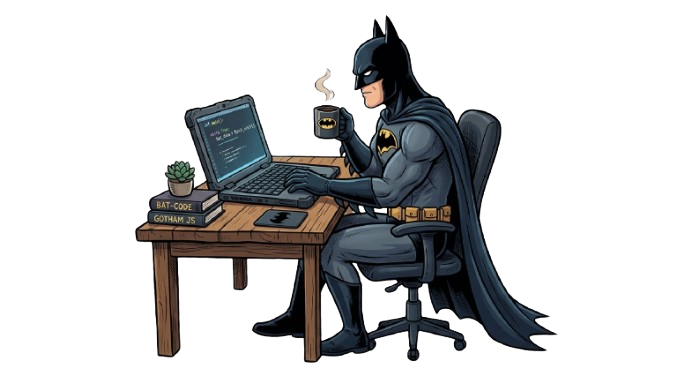

<h2>Luiz Felipe Ribeiro</h2>

**`Desenvolvedor FullStack & QA`**

Me chamo Luiz Felipe, tenho 22 anos e sou de Sergipe.

Sou desenvolvedor Web fullstack e QA com experiência de trabalho. Tenho uma grande paixão pela área de TI, na qual já me dedico desde a infância quando tive meu primeiro contato com computadores e videogames. Um grande entusiasta de Hardware e Software tentando evoluir a cada dia.

 

### Linguagens e Tecnologias

 
