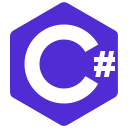

Hello! I'm Luiz Felipe, a Back-end Developer and Quality Assurance (QA) professional from Brazil.

My passion for technology began in childhood, when I discovered computers and video games. Over the years, that curiosity evolved into a strong interest in software development and quality assurance.

Currently, I work as a Web Developer while building my career in QA. I enjoy developing reliable back-end applications and contributing to software quality through manual testing, bug reporting and continuous improvement.

I'm constantly expanding my knowledge in technologies such as PHP, Laravel, C#, SQL, Docker, and software testing. My goal is to grow into a Software Engineer capable of designing scalable systems and delivering high-quality solutions.

### Languages ​​and Technologies

  
  &nbsp;
  
  &nbsp;
  
  &nbsp;
  
  &nbsp;
  
  &nbsp;
  
  &nbsp;
  
  &nbsp;
  
  &nbsp;
  
  &nbsp;
  
  &nbsp;
  

